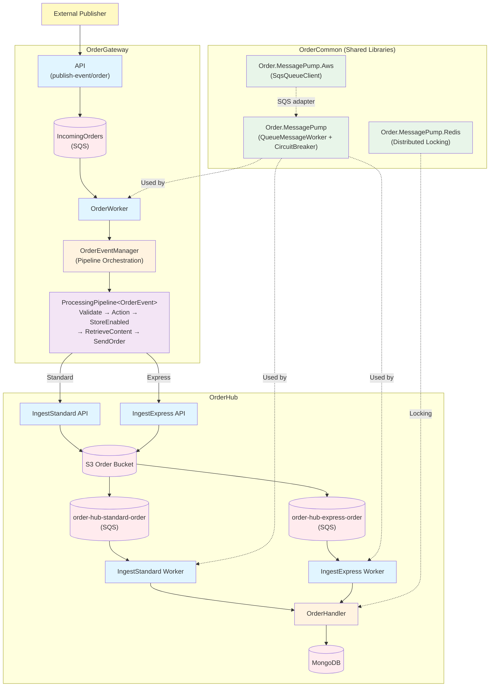
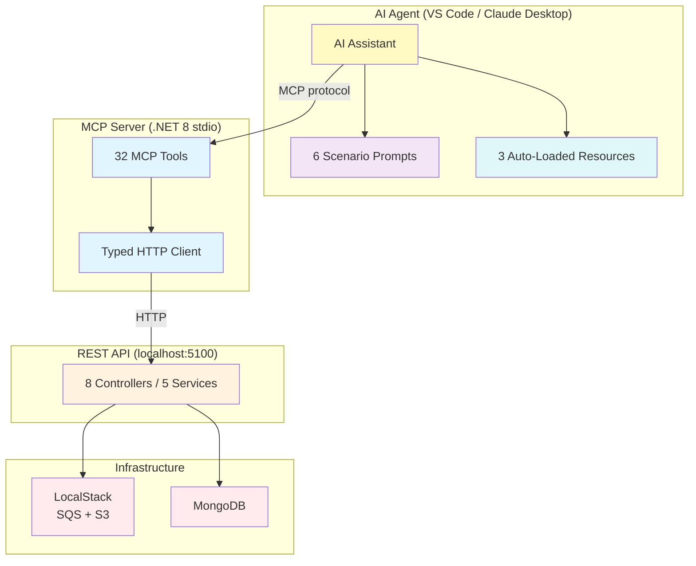

# Communication — Project Presentation

## Project Name

Communication — Distributed Order Processing Platform

## Description

Communication is a multi-solution .NET 8 platform that processes orders across two service boundaries. OrderGateway accepts inbound queue events, validates and enriches them through a step-based processing pipeline, then forwards ingest requests to OrderHub. OrderHub APIs persist order payloads to S3, trigger queue notifications, and workers process those notifications into MongoDB with duplicate protection, distributed locking, and correlation tracking.

The platform also includes an **MCP (Model Context Protocol) server** that enables AI assistants (VS Code Copilot Chat, Claude Desktop) to directly operate the entire pipeline — sending test orders, tracing them through every hop, inspecting queues and S3, querying MongoDB, and replaying dead-letter messages — all through natural language conversation.

The implementation focuses on production-grade operational discipline: event-driven service architecture, OAuth-secured service-to-service communication, config-driven environment switching (LocalStack/AWS), resilient queue processing with circuit breakers and retry policies, Aspire orchestration, and layered test coverage across unit and integration boundaries.

## Skills Demonstrated

- Event-driven distributed architecture with SQS queues, S3 storage, and MongoDB persistence
- Step-based processing pipeline with pluggable validation, content retrieval, and routing stages
- OAuth client-credentials flow for secure service-to-service communication (Keycloak local / AWS production)
- NSwag-generated API clients with correlation ID propagation
- Feature flag integration (LaunchDarkly) for controlled rollouts
- Aspire AppHost orchestration for local multi-service development
- Shared library design for queue pump, circuit breaker, and distributed locking primitives
- Integration testing strategy using LocalStack, in-memory fakes, and environment-specific configuration
- **MCP server with 32 tools, 6 prompts, and 3 resources** enabling AI agents to test, trace, and operate the full order pipeline through natural language

## Architecture

## Validation

```mermaid
graph TD
    UNIT_GW["OrderGateway<br/>Unit Tests<br/>(112 Cases)"]
    UNIT_GW -->|"Validates"| GW_DOMAIN["Managers / Handlers<br/>Mappers / Pipeline Steps<br/>Services / Validators"]

    UNIT_HUB["OrderHub<br/>Unit Tests<br/>(94 Cases)"]
    UNIT_HUB -->|"Validates"| HUB_DOMAIN["Ingestion Mappers<br/>Validation Attributes<br/>Helpers / Encoders"]

    INT_GW["OrderGateway<br/>Integration Tests"]
    INT_GW_E2E["End-to-End Event Tests"]
    INT_GW_E2E -->|"Uses"| LS_GW["LocalStack<br/>(SQS + S3)"]
    INT_GW_E2E -->|"Validates"| GW_FLOW["Full Pipeline:<br/>Queue → Validate → Enrich<br/>→ Map → Send"]

    INT_GW_REDIS["Redis CRUD Tests"]
    INT_GW_REDIS -->|"Validates"| REDIS["Redis Cache<br/>Operations"]

    INT_GW_PUMP["MessagePump<br/>Resiliency Tests"]
    INT_GW_PUMP -->|"Validates"| CB["Circuit Breaker<br/>Visibility Timeout<br/>Retry Routing"]

    INT_GW --> INT_GW_E2E
    INT_GW --> INT_GW_REDIS
    INT_GW --> INT_GW_PUMP

    INT_HUB["OrderHub<br/>Integration Tests"]
    INT_HUB_INGEST["IngestExpress<br/>Shipment Order Tests"]
    INT_HUB_INGEST -->|"Validates"| HUB_FLOW["API → S3 Persist<br/>Validation / Dedup<br/>Content Truncation"]

    INT_HUB_PUMP["MessagePump<br/>Resiliency Tests"]
    INT_HUB_PUMP -->|"Validates"| CB2["Circuit Breaker<br/>Visibility Timeout<br/>Retry Routing"]

    INT_HUB --> INT_HUB_INGEST
    INT_HUB --> INT_HUB_PUMP

    UNIT_GW -->|"Pass"| R1["✓ 112 Unit Green"]
    UNIT_HUB -->|"Pass"| R2["✓ 94 Unit Green"]
    INT_GW -->|"Pass"| R3["✓ Integration Green"]
    INT_HUB -->|"Pass"| R4["✓ Integration Green"]

    R1 --> FINAL["All Tests Green<br/>Solutions Valid"]
    R2 --> FINAL
    R3 --> FINAL
    R4 --> FINAL

    FINAL -->|"Confirms"| CHECKS["✓ Pipeline Orchestration<br/>✓ Queue Resiliency<br/>✓ S3 Persistence<br/>✓ OAuth Contract<br/>✓ Duplicate Detection"]

    style UNIT_GW fill:#f3e5f5
    style UNIT_HUB fill:#f3e5f5
    style INT_GW fill:#fff3e0
    style INT_HUB fill:#fff3e0
    style INT_GW_E2E fill:#e1f5ff
    style INT_GW_REDIS fill:#e1f5ff
    style INT_GW_PUMP fill:#e1f5ff
    style INT_HUB_INGEST fill:#e1f5ff
    style INT_HUB_PUMP fill:#e1f5ff
    style GW_DOMAIN fill:#e8f5e9
    style HUB_DOMAIN fill:#e8f5e9
    style GW_FLOW fill:#e8f5e9
    style HUB_FLOW fill:#e8f5e9
    style LS_GW fill:#fff9c4
    style REDIS fill:#fff9c4
    style CB fill:#fce4ec
    style CB2 fill:#fce4ec
    style R1 fill:#c8e6c9
    style R2 fill:#c8e6c9
    style R3 fill:#c8e6c9
    style R4 fill:#c8e6c9
    style FINAL fill:#81c784
    style CHECKS fill:#c8e6c9
```

Current validation:
- OrderGateway unit tests: `112` pass
- OrderHub unit tests: `94` pass
- MessageOperations unit tests: `107` pass
- Integration tests: all pass
- Total: `313+` test cases across all solutions

## MCP Agent — AI-Assisted Pipeline Testing

The platform includes a **Model Context Protocol (MCP)** server that gives AI assistants (VS Code Copilot Chat, Claude Desktop) the ability to directly operate the order processing pipeline through natural language conversation.

Instead of manually running scripts, crafting `curl` commands, and checking queues by hand, you describe what you want and the AI agent executes the steps, reporting results as it goes.

| Capability | Count | Examples |
|---|---|---|
| **Tools** | 32 | Queue inspection, S3 operations, order queries, DLQ replay, test data generation, end-to-end tracing |
| **Prompts** | 6 | `setup-localstack`, `build-and-run`, `run-standard-orders`, `run-express-orders`, `end-to-end-trace`, `tear-down` |
| **Resources** | 3 | System topology, live queue health, recent orders |

## Endpoint Snapshot

- **OrderGateway API**
  - `POST /api/v{version}/publish-event/order`
  - `POST /api/v{version}/event-handler/order-status`
  - `GET|POST|DELETE /api/v{version}/redis`
- **OrderHub IngestStandard API**
  - `POST /api/order/digital`
  - `POST /api/order/standard`
- **OrderHub IngestExpress API**
  - `POST /api/order/digital`
  - `POST /api/order/standard`
- **MessageOperations API**
  - `GET /api/v1/queues/*` — Queue inspection, send, purge
  - `GET /api/v1/s3/*` — S3 bucket/object operations
  - `GET /api/v1/orders/*` — MongoDB order queries
  - `POST /api/v1/trace/*` — End-to-end tracing and polling
  - `POST /api/v1/test-data/*` — Test order generation
  - `GET /api/v1/health/*` — Infrastructure health checks

## Skills (Top 6)

1. Event-driven distributed service architecture (.NET 8 + SQS + S3 + MongoDB)
2. Step-based processing pipeline with pluggable stages and feature-flag gating
3. OAuth-secured service-to-service communication with config-driven environment switching
4. MCP server enabling AI agents to operate the pipeline through natural language
5. Integration testing with LocalStack, Aspire orchestration, and resilient queue processing
6. Operational observability (correlation IDs, structured logging, health checks, NewRelic/Splunk/OpenTelemetry)

## One-Line Summary

Designed and evolved a production-grade distributed order processing platform with event-driven queue ingestion, step-based pipeline orchestration, OAuth-secured cross-service routing, and an MCP server that enables AI agents to test, trace, and operate the entire pipeline through natural language.
