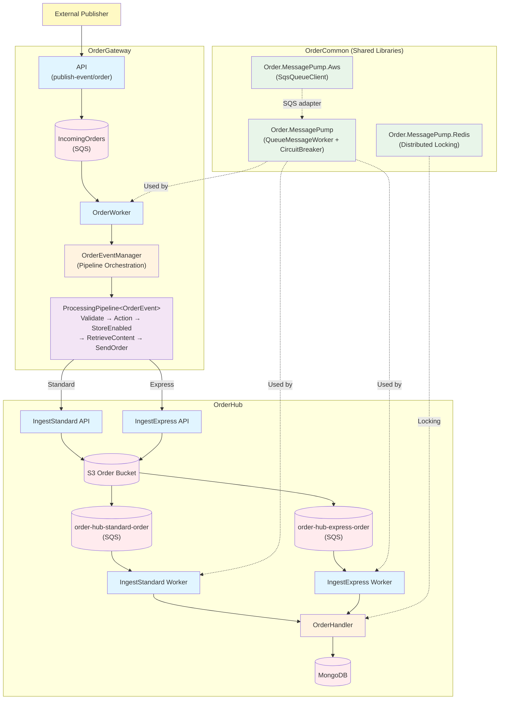
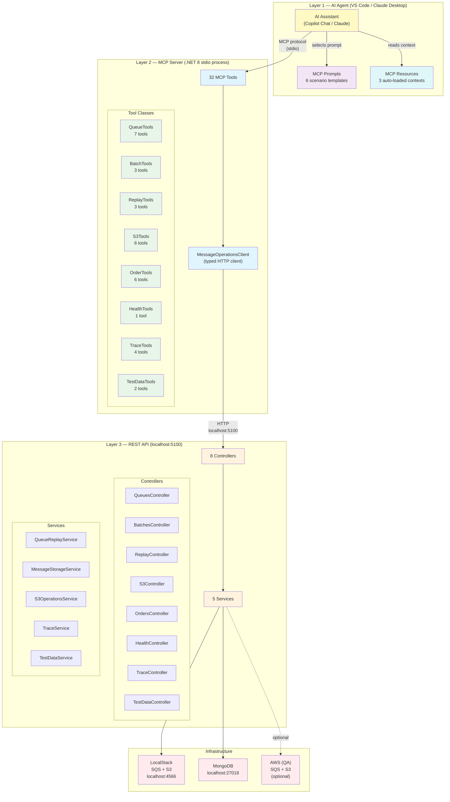

# Order-Flow

`Order-Flow` is a multi-solution `.NET 8` distributed order processing platform that ingests orders across two service boundaries through event-driven queues, step-based pipeline orchestration, and S3/MongoDB persistence.

It is designed as a production-grade layered architecture with OAuth-secured service-to-service communication, config-driven environment switching, Aspire orchestration, and resilient queue processing.

`Order-Flow` demonstrates a specific approach:

- **Event-driven ingestion** through SQS queues with circuit-breaker resilience
- **Step-based pipeline orchestration** through `ProcessingPipeline<TEvent>` with pluggable stages
- **OAuth-secured cross-service routing** through client-credentials flow (Keycloak local / AWS production)
- **Dual-path persistence** through S3 storage + queue notification + MongoDB worker processing
- **Shared library primitives** through `Order.MessagePump` for queue pump, retry, and distributed locking
- **AI-assisted pipeline testing** through an MCP server with 32 tools, 6 prompts, and 3 resources that lets AI agents operate the entire pipeline via natural language

The result is a platform where OrderGateway validates, enriches, and routes events to OrderHub, which persists and processes them with duplicate protection and correlation tracking.

---

## Architecture Overview



### Layer Responsibilities

- `OrderGateway.Api/`: HTTP entry point for publishing order events
- `OrderGateway.OrderWorker/`: background worker that polls the IncomingOrders SQS queue
- `OrderGateway.Common/`: pipeline orchestration, event managers, NSwag-generated clients, mapping, feature flags
- `OrderHub.IngestStandard.Api/` + `IngestExpress.Api/`: ingest APIs that persist order payloads to S3
- `OrderHub.IngestStandard.Worker/` + `IngestExpress.Worker/`: workers that process S3 event notifications from queues
- `OrderHub.Common/`: handlers, managers, repository, S3 service, content processing, mappers
- `OrderHub.Contracts/`: shared request/response models and validation attributes
- `OrderHub.Api/`: read/query API for accessing persisted orders
- `OrderCommon/Order.MessagePump/`: generic queue worker abstraction with circuit breaker (Polly)
- `OrderCommon/Order.MessagePump.Aws/`: SQS adapter implementing queue client interface
- `OrderCommon/Order.MessagePump.Redis/`: Redis-based distributed locking

### Solution Layout

- `OrderGateway/src/OrderGateway.Api/`: API host for publishing order events
- `OrderGateway/src/OrderGateway.OrderWorker/`: background worker polling SQS
- `OrderGateway/src/OrderGateway.Common/`: shared business logic, pipeline, clients, mapping
- `OrderGateway/src/OrderGateway.AppHost/`: Aspire AppHost orchestrating API + Worker
- `OrderGateway/src/Order.ReplayConsole/`: diagnostic tool for replaying DLQ messages locally
- `OrderGateway/src/OrderGateway.UnitTests/`: unit tests (112 cases)
- `OrderGateway/src/OrderGateway.IntegrationTests/`: integration tests (LocalStack + resiliency)
- `OrderHub/src/OrderHub.Api/`: read/query API for persisted orders
- `OrderHub/src/OrderHub.IngestStandard.Api/`: standard-priority ingest API
- `OrderHub/src/OrderHub.IngestExpress.Api/`: express-priority ingest API
- `OrderHub/src/OrderHub.IngestStandard.Worker/`: standard-priority queue worker
- `OrderHub/src/OrderHub.IngestExpress.Worker/`: express-priority queue worker
- `OrderHub/src/OrderHub.Common/`: shared handlers, managers, repository, services, mappers
- `OrderHub/src/OrderHub.Contracts/`: contract models and validation attributes
- `OrderHub/src/OrderHub.AppHost/`: Aspire AppHost orchestrating 5 services
- `OrderHub/src/OrderHub.UnitTests/`: unit tests (94 cases)
- `OrderHub/src/OrderHub.IntegrationTests/`: integration tests (IngestExpress + resiliency)
- `OrderCommon/src/Order.MessagePump/`: generic queue worker pipeline with circuit breaker
- `OrderCommon/src/Order.MessagePump.Aws/`: AWS SQS adapter
- `OrderCommon/src/Order.MessagePump.Redis/`: Redis distributed locking
- `Order.MessageOperations/Order.MessageOperations.Api/`: diagnostic REST API (8 controllers, 5 services) for queue/S3/trace/test-data operations
- `Order.MessageOperations/Order.MessageOperations.Mcp/`: MCP server (32 tools, 6 prompts, 3 resources) for AI-assisted pipeline testing and tracing

---

## Project Scope

Current solution coverage includes:

- OrderGateway: API + worker with step-based processing pipeline
- OrderHub: two ingest API/worker pairs (Standard + Express) + read/query API
- OAuth client-credentials flow for cross-service auth (Keycloak local, AWS production)
- NSwag-generated API clients with correlation ID propagation
- Feature flag gating (LaunchDarkly) for per-store rollouts
- Shared queue pump library with circuit breaker, retry routing, and visibility timeout management
- Distributed locking via Redis for duplicate protection during ingestion
- Aspire AppHost orchestration for local multi-service development
- LocalStack infrastructure scripts (SQS, S3, MongoDB, Redis, Keycloak)
- Order.MessageOperations: diagnostic API + MCP server with 32 tools, 6 prompts, and 3 resources for AI-driven pipeline testing, order tracing, queue inspection, DLQ replay, test data generation, and S3 operations
- Unit and integration tests via xUnit + NSubstitute

---

## Evaluator Quick Path

If you are reviewing this project fresh, use this path:

1. Restore and build the solutions:
    ```bash
    dotnet restore OrderGateway/OrderGateway.sln
    dotnet build OrderGateway/OrderGateway.sln --no-logo
    dotnet restore OrderHub/OrderHub.slnx
    dotnet build OrderHub/OrderHub.slnx --no-logo
    ```
2. Run the test suite:
    ```bash
    dotnet test OrderGateway/OrderGateway.sln --no-logo --verbosity minimal
    dotnet test OrderHub/OrderHub.slnx --no-logo --verbosity minimal
    ```
3. Start local infrastructure (Docker required):
    ```powershell
    cd OrderHub/ifx-aws-cli/local
    ./start.ps1
    ```
4. Run Aspire AppHosts:
    ```powershell
    $env:DOTNET_ENVIRONMENT='localstack'; $env:ASPNETCORE_ENVIRONMENT='localstack'
    dotnet run --project OrderHub/src/OrderHub.AppHost/OrderHub.AppHost.csproj
    # In a second terminal:
    dotnet run --project OrderGateway/src/OrderGateway.AppHost/OrderGateway.AppHost.csproj
    ```

Expected result: all tests pass (`206+` cases), both Aspire dashboards show all services green, and the full pipeline executes through queue → pipeline → API → S3 → worker → MongoDB.

---

## Quick Start

### 1) Prerequisites

- .NET SDK 8+
- Docker Desktop (for LocalStack, MongoDB, Redis, Keycloak)
- PowerShell 7+
- Optional: Visual Studio 2022 or VS Code

After install, verify tools:

```powershell
dotnet --version
docker --version
pwsh --version
```

### 2) Start Local Infrastructure

```powershell
cd OrderHub/ifx-aws-cli/local
./stop.ps1
./clean.ps1 -Force

cd ../../OrderGateway/ifx-aws-cli/local
./stop.ps1
./clean.ps1 -Force

cd OrderHub/ifx-aws-cli/local
./start.ps1
```

Wait for **"All services are running!"** then verify:

```powershell
./status.ps1
```

Expected services:
- LocalStack: `http://localhost:4566`
- MongoDB: `mongodb://localhost:27018`
- Redis: `localhost:6379`
- Keycloak: `http://localhost:8081`

Then start OrderGateway infrastructure:

```powershell
./start.ps1
```
Wait for **"All services are running!"** then verify:

```powershell
./status.ps1
```

### 3) Build and Run

```powershell
dotnet restore OrderGateway/OrderGateway.sln
dotnet build OrderGateway/OrderGateway.sln
dotnet restore OrderHub/OrderHub.slnx
dotnet build OrderHub/OrderHub.slnx
```

Run OrderHub AppHost (orchestrates 5 services):

```powershell
$env:DOTNET_ENVIRONMENT='localstack'; $env:ASPNETCORE_ENVIRONMENT='localstack'
dotnet run --project OrderHub/src/OrderHub.AppHost/OrderHub.AppHost.csproj
```

Run OrderGateway AppHost (orchestrates API + Worker):

```powershell
$env:DOTNET_ENVIRONMENT='localstack'; $env:ASPNETCORE_ENVIRONMENT='localstack'
dotnet run --project OrderGateway/src/OrderGateway.AppHost/OrderGateway.AppHost.csproj
```

### 4) Confirm End-to-End

1. Both Aspire dashboards show all services running.
2. Keycloak OIDC discovery resolves: `http://localhost:8081/realms/ordergateway-local/.well-known/openid-configuration`
3. Run replay/publish to place a test event on the OrderGateway queue.
4. OrderWorker logs show processing and successful calls to OrderHub APIs.
5. OrderHub API logs show authorized requests (no 401).
6. MongoDB contains the persisted order data.

### 5) Tear Down

```powershell
# Stop AppHosts: Ctrl+C in each terminal, then:
cd OrderGateway/ifx-aws-cli/local
./stop.ps1
cd ../../OrderHub/ifx-aws-cli/local
./stop.ps1
```

---

## Testing

Run OrderGateway unit tests:

```bash
dotnet test OrderGateway/OrderGateway.sln --filter "FullyQualifiedName~UnitTests" --no-logo --verbosity minimal
```

Run OrderHub unit tests:

```bash
dotnet test OrderHub/OrderHub.slnx --filter "FullyQualifiedName~UnitTests" --no-logo --verbosity minimal
```

Run all tests (both solutions):

```bash
dotnet test OrderGateway/OrderGateway.sln --no-logo --verbosity minimal
dotnet test OrderHub/OrderHub.slnx --no-logo --verbosity minimal
```

### Integration Testing Strategy

```mermaid
graph TD
    UNIT_GW["OrderGateway<br/>Unit Tests<br/>(112 Cases)"]
    UNIT_GW -->|"Validates"| GW_DOMAIN["Managers / Handlers<br/>Mappers / Pipeline Steps<br/>Services / Validators"]

    UNIT_HUB["OrderHub<br/>Unit Tests<br/>(94 Cases)"]
    UNIT_HUB -->|"Validates"| HUB_DOMAIN["Ingestion Mappers<br/>Validation Attributes<br/>Helpers / Encoders"]

    INT_GW["OrderGateway<br/>Integration Tests"]
    INT_GW_E2E["End-to-End Event Tests"]
    INT_GW_E2E -->|"Uses"| LS_GW["LocalStack<br/>(SQS + S3)"]
    INT_GW_E2E -->|"Validates"| GW_FLOW["Full Pipeline:<br/>Queue → Validate → Enrich<br/>→ Map → Send"]

    INT_GW_REDIS["Redis CRUD Tests"]
    INT_GW_REDIS -->|"Validates"| REDIS["Redis Cache<br/>Operations"]

    INT_GW_PUMP["MessagePump<br/>Resiliency Tests"]
    INT_GW_PUMP -->|"Validates"| CB["Circuit Breaker<br/>Visibility Timeout<br/>Retry Routing"]

    INT_GW --> INT_GW_E2E
    INT_GW --> INT_GW_REDIS
    INT_GW --> INT_GW_PUMP

    INT_HUB["OrderHub<br/>Integration Tests"]
    INT_HUB_INGEST["IngestExpress<br/>Shipment Order Tests"]
    INT_HUB_INGEST -->|"Validates"| HUB_FLOW["API → S3 Persist<br/>Validation / Dedup<br/>Content Truncation"]

    INT_HUB_PUMP["MessagePump<br/>Resiliency Tests"]
    INT_HUB_PUMP -->|"Validates"| CB2["Circuit Breaker<br/>Visibility Timeout<br/>Retry Routing"]

    INT_HUB --> INT_HUB_INGEST
    INT_HUB --> INT_HUB_PUMP

    UNIT_GW -->|"Pass"| R1["✓ 112 Unit Green"]
    UNIT_HUB -->|"Pass"| R2["✓ 94 Unit Green"]
    INT_GW -->|"Pass"| R3["✓ Integration Green"]
    INT_HUB -->|"Pass"| R4["✓ Integration Green"]

    R1 --> FINAL["All Tests Green<br/>Solutions Valid"]
    R2 --> FINAL
    R3 --> FINAL
    R4 --> FINAL

    FINAL -->|"Confirms"| CHECKS["✓ Pipeline Orchestration<br/>✓ Queue Resiliency<br/>✓ S3 Persistence<br/>✓ OAuth Contract<br/>✓ Duplicate Detection"]

    style UNIT_GW fill:#f3e5f5
    style UNIT_HUB fill:#f3e5f5
    style INT_GW fill:#fff3e0
    style INT_HUB fill:#fff3e0
    style INT_GW_E2E fill:#e1f5ff
    style INT_GW_REDIS fill:#e1f5ff
    style INT_GW_PUMP fill:#e1f5ff
    style INT_HUB_INGEST fill:#e1f5ff
    style INT_HUB_PUMP fill:#e1f5ff
    style GW_DOMAIN fill:#e8f5e9
    style HUB_DOMAIN fill:#e8f5e9
    style GW_FLOW fill:#e8f5e9
    style HUB_FLOW fill:#e8f5e9
    style LS_GW fill:#fff9c4
    style REDIS fill:#fff9c4
    style CB fill:#fce4ec
    style CB2 fill:#fce4ec
    style R1 fill:#c8e6c9
    style R2 fill:#c8e6c9
    style R3 fill:#c8e6c9
    style R4 fill:#c8e6c9
    style FINAL fill:#81c784
    style CHECKS fill:#c8e6c9
```



Current status:
- OrderGateway unit tests: `112` passing
- OrderHub unit tests: `94` passing
- Integration tests: all passing
- Total: `206+` passing

---

## Key Abstractions

### Processing Pipeline (OrderGateway)

The pipeline is composed of pluggable `IProcessingStep<TEvent>` implementations:

| Step | Purpose |
|------|---------|
| `ValidateStep<T>` | Validates event via `IsValid()`, rejects invalid events |
| `ActionStep<T>` | Executes inline telemetry/metric actions |
| `StoreEnabledStep<T>` | Feature-flag gate — checks LaunchDarkly for store enablement |
| `RetrieveOrderContentStep` | Retrieves cloud content by key, attaches to context |
| `SendOrderStep<T>` | Routes to Standard or Express ingest API via NSwag clients |

### OrderHub Handler Flow

The `BaseMessageHandler<T>` template method provides:

| Phase | Behavior |
|-------|----------|
| Parse | Deserialize SQS message body into typed payload |
| Process | S3 retrieval → content processing → mapping → lock acquisition → MongoDB insert |
| Retry | Exponential backoff with SQS visibility timeout extension |
| Poison | Route to dead-letter queue after max retries |

### Shared Queue Worker (OrderCommon)

| Component | Purpose |
|-----------|---------|
| `QueueMessageWorker<T>` | Generic worker loop with Polly circuit breaker |
| `SqsQueueClient` | SQS adapter: get/complete/poison/publish messages |
| `SimpleRedisLockManager` | Distributed locking for duplicate protection |

---

## Configuration and Security

### Environment Variables

The same code path is used for LocalStack and AWS. Configuration controls the behavior:

| Variable | Purpose |
|----------|---------|
| `DOTNET_ENVIRONMENT` / `ASPNETCORE_ENVIRONMENT` | Selects appsettings overlay (`localstack`, `aws`) |
| `OAuth:*:AuthorityUrl` | Token endpoint for client-credentials flow |
| `OAuth:*:ClientId` / `ClientSecret` / `Scope` | OAuth client registration |
| `*:BridgeOAuthSettings:Authority` / `Audience` | JWT bearer validation on OrderHub APIs |
| `Clients:IngestStandardClient:BaseAddress` | Standard ingest API destination |
| `Clients:IngestExpressClient:BaseAddress` | Express ingest API destination |
| `Aws:Connection:ServiceUrl` / `Region` | AWS/LocalStack endpoint |
| `QueueClientOptions:*:QueueName` | SQS queue names |

### AWS Production

- Store `ClientSecret` and API keys in Secrets Manager/SSM and inject at runtime.
- Use IAM roles for runtime credentials where possible.
- Do not keep production secrets in source-controlled appsettings.

### Local Auth Contract

For local development, the token issuer is Keycloak realm `ordergateway-local`:

- Authority: `http://localhost:8081/realms/ordergateway-local`
- Token endpoint: `http://localhost:8081/realms/ordergateway-local/protocol/openid-connect/token`
- Audience: `non-production-resources`
- Required scopes: `commonorders.ingeststandard-api.communication.write`, `commonorders.ingestexpress-api.communication.write`

---

## Engineering Practices Demonstrated

- SOLID-oriented layered architecture across multiple solutions
- Step-based pipeline with pluggable processing stages
- OAuth client-credentials and JWT bearer validation for service-to-service auth
- Dependency injection with primary constructors across services, handlers, and managers
- NSwag code generation for type-safe API clients from swagger.json
- Circuit breaker and retry policies (Polly) for resilient queue processing
- Distributed locking via Redis for concurrent duplicate protection
- Feature flag integration (LaunchDarkly) for controlled per-store rollouts
- Aspire AppHost orchestration for multi-service local development
- Structured logging with Serilog + correlation IDs + NewRelic/Splunk/OpenTelemetry
- Config-driven environment switching (appsettings.localstack.json / appsettings.aws.json)
- Test layering (unit + integration) with LocalStack, NSubstitute mocks, and explicit behavior verification

---

## MCP Agent — AI-Assisted Order Pipeline Testing

The platform includes a **Model Context Protocol (MCP)** server that gives AI assistants (VS Code Copilot Chat, Claude Desktop) the ability to directly operate the order processing pipeline — sending messages, tracing orders, querying databases, and generating test data through natural language conversation.

Instead of manually running scripts, crafting `curl` commands, and checking queues by hand, you describe what you want and the AI agent executes every step, reporting results as it goes.

### What This Enables

> **You say**: *"Run 5 standard orders through the pipeline and show me what happens at each step"*
>
> **The agent**: generates 5 realistic order payloads → sends them to the gateway queue → monitors queue depths → traces each order through S3 and downstream queues → reports a summary table with order IDs, timings, and status at each hop.

### Architecture — The Three Layers

The MCP agent operates through three distinct layers, each with a clear responsibility:



#### Layer 1 — AI Agent (the brain)

The AI assistant in VS Code Copilot Chat or Claude Desktop. It reads **MCP Prompts** (scenario templates that encode multi-step workflows) and **MCP Resources** (auto-loaded context like system topology, queue health, and recent orders) to understand the current system state. It then decides which **MCP Tools** to call and in what order. The agent handles all reasoning, sequencing, error recovery, and user reporting.

#### Layer 2 — MCP Server (the hands)

A .NET 8 console application (`Order.MessageOperations.Mcp`) that communicates with the AI over **stdio** using the Model Context Protocol. It exposes **32 tools**, **6 prompts**, and **3 resources** that the AI can discover and call. Prompt templates are stored as external `.md` files in `Prompts/Templates/` so they can be edited without recompiling. Each tool is a thin adapter — it validates inputs and forwards to the REST API via a typed HTTP client (`MessageOperationsClient`).

#### Layer 3 — REST API (the muscles)

A .NET 8 Web API (`Order.MessageOperations.Api`) running on `localhost:5100` that does the actual work — talking to LocalStack SQS queues, S3 buckets, and MongoDB. All business logic lives here: queue operations, S3 management, order queries, trace polling, and test data generation. The API works independently — you can call it with `curl` or a browser without the MCP layer.

### How Data Flows

```
You type: "Send 3 express orders and trace them"
    │
    ▼
┌─────────────────────────────────────────────────────────────────┐
│  AI Agent reads the "run-express-orders" prompt template        │
│  which tells it the exact sequence of tools to call             │
└─────────────────────────────────────────────────────────────────┘
    │
    ▼ Step 1: GenerateAndSendOrders(priority=express, count=3)
┌─────────────────────────────────────────────────────────────────┐
│  MCP Server → HTTP POST /api/v1/test-data/generate-orders      │
│  TestDataService builds 3 base64-encoded OrderEvent payloads   │
│  MCP Server → HTTP POST /api/v1/queues/{name}/send (×3)        │
│  Messages land on order-gateway-incoming queue                  │
└─────────────────────────────────────────────────────────────────┘
    │
    ▼ Step 2: GetAllQueueDepths()
┌─────────────────────────────────────────────────────────────────┐
│  MCP Server → HTTP GET /api/v1/trace/queue-depth-snapshot      │
│  Returns message counts for all 6 queue pairs                  │
│  Agent reports: "3 messages in gateway queue"                   │
└─────────────────────────────────────────────────────────────────┘
    │
    ▼ Step 3: WaitForQueueMessage(queue=order-hub-express-order)
┌─────────────────────────────────────────────────────────────────┐
│  MCP Server → HTTP POST /api/v1/trace/wait-for-queue-message   │
│  TraceService polls queue every 2s until messages appear        │
│  Agent reports: "Orders arrived in express queue after 4.2s"    │
└─────────────────────────────────────────────────────────────────┘
    │
    ▼ Agent compiles summary table with per-order results
```

### Complete Tool Inventory (32 Tools)

| Tool Class | Tool | Type | Description |
|---|---|---|---|
| **QueueTools** | `ListConfiguredQueues` | Read | Show all configured queue names and their LocalStack mappings |
| | `ListLocalStackQueues` | Read | List all queues that exist in LocalStack |
| | `GetQueueStatus` | Read | Get message count + in-flight count for a specific queue |
| | `PeekQueueMessages` | Read | Read messages from a queue without consuming them |
| | `SendTestMessage` | Write | Send a JSON message body to any LocalStack queue |
| | `PurgeQueue` | Write | Delete all messages from a specific queue |
| | `PurgeAllQueues` | Write | Purge all configured queues (test cleanup) |
| **BatchTools** | `ListBatches` | Read | List all saved message batches on disk |
| | `GetBatchDetails` | Read | Get metadata for a specific saved batch |
| | `GetBatchMessages` | Read | Read messages from a saved batch |
| **ReplayTools** | `DownloadMessages` | Read/Write | Download messages from an AWS DLQ to a local batch |
| | `ReplayFromBatch` | Write | Replay a saved batch to a LocalStack queue |
| | `DownloadAndReplay` | Read/Write | Download from AWS DLQ and immediately replay to LocalStack |
| **S3Tools** | `ListS3Buckets` | Read | List all S3 buckets (LocalStack or AWS) |
| | `ListS3Objects` | Read | List objects in an S3 bucket with optional prefix filter |
| | `GetS3ObjectMetadata` | Read | Get metadata (size, content-type, last-modified) for an S3 object |
| | `GetS3ObjectContent` | Read | Download and return the content of an S3 object |
| | `SyncS3FromBatch` | Write | Sync S3 objects referenced by a saved batch |
| | `UploadS3Object` | Write | Upload content to an S3 bucket |
| **OrderTools** | `GetOrder` | Read | Get a specific order by store ID and order ID from MongoDB |
| | `GetCustomerOrders` | Read | Get all orders for a customer in a store |
| | `SearchOrders` | Read | Search orders by keyword across store |
| | `GetOrderSummary` | Read | Get order count and date range summary for a store |
| | `FindByProvider` | Read | Find an order by merchant/provider order ID |
| | `GetRecentOrders` | Read | Get the most recent orders for a store |
| **HealthTools** | `CheckLocalStackHealth` | Read | Verify SQS + S3 connectivity and return service status |
| **TraceTools** | `WaitForS3Object` | Read (poll) | Poll S3 until an object matching a key prefix appears |
| | `WaitForQueueMessage` | Read (poll) | Poll a queue until a message matching a filter appears |
| | `WaitForMongoDocument` | Read (poll) | Poll MongoDB until an order matching criteria appears |
| | `GetAllQueueDepths` | Read | Snapshot of message counts for all configured queues |
| **TestDataTools** | `GenerateTestOrders` | Read | Generate realistic test order payloads (returns JSON, doesn't send) |
| | `GenerateAndSendOrders` | Write | Generate orders AND send them to the target queue in one call |

### MCP Prompts (6 Scenario Templates)

Prompts are pre-built workflow templates stored as external `.md` files in `Prompts/Templates/`. They tell the AI agent exactly which tools to call and in what order, and can be edited without recompiling.

| Prompt | Parameters | What It Does |
|---|---|---|
| `setup-localstack` | — | Full infrastructure setup: verify prerequisites, stop/clean both OrderHub and OrderGateway, start containers (LocalStack, MongoDB, Redis, Keycloak), verify queues and S3 |
| `build-and-run` | — | Restore/build both solutions, launch both Aspire AppHosts with `localstack` environment, confirm end-to-end with Keycloak OIDC check and a test order |
| `run-standard-orders` | `count` (default: 5), `storeId` (optional) | Generate N standard-priority orders → send to gateway queue → check queue depths → trace to `order-hub-standard-order` → summarize results |
| `run-express-orders` | `count` (default: 5), `storeId` (optional) | Same flow but traces express-priority orders through `order-hub-express-order` |
| `end-to-end-trace` | `priority` (default: standard), `storeId` (optional) | Single order traced through all 4 hops: gateway queue → downstream queue → S3 → MongoDB with timing at each stage |
| `tear-down` | — | Kill all running .NET applications (AppHosts, APIs, Workers), then stop and clean both OrderGateway and OrderHub infrastructure containers |

#### Prompt Template Files

Prompt templates live in `Order.MessageOperations.Mcp/Prompts/Templates/` as `.md` files:

| File | Prompt |
|---|---|
| `setup-localstack.md` | `setup-localstack` |
| `build-and-run.md` | `build-and-run` |
| `run-standard-orders.md` | `run-standard-orders` |
| `run-express-orders.md` | `run-express-orders` |
| `end-to-end-trace.md` | `end-to-end-trace` |
| `tear-down.md` | `tear-down` |

Templates use `{{placeholder}}` syntax for dynamic values (e.g., `{{count}}`, `{{storeNote}}`, `{{priority}}`). The C# code in `OrderPrompts.cs` replaces these at runtime.

To add a new prompt:
1. Create a new `.md` file in `Prompts/Templates/`
2. Add a method to `OrderPrompts.cs` with `[McpServerPrompt]` and `[Description]` attributes
3. Call `LoadTemplate("your-file.md")` — or `LoadTemplate("your-file.md", replacements)` if the template has placeholders
4. Rebuild — the `.csproj` copies `*.md` files to the output directory automatically

### MCP Resources (3 Auto-Loaded Contexts)

Resources are read-only data endpoints that the AI agent can load automatically to understand the current system state before taking action. Unlike tools (which the agent calls on demand), resources provide ambient context.

| Resource URI | Name | What It Provides |
|---|---|---|
| `order-ops://topology` | `system-topology` | Complete system map showing all services, their ports, queue names, S3 buckets, and how they connect — gives the agent architectural awareness without asking |
| `order-ops://queue-health` | `queue-health` | Live message counts for all 6 queues (including DLQs) — the agent sees queue state before deciding what to do |
| `order-ops://recent-orders` | `recent-orders` | Last 10 orders from MongoDB with timestamps and priorities — provides immediate data context |

Resources are defined in `OrderResources.cs` using `[McpServerResource]` attributes and registered via `.WithResources<OrderResources>()` in `Program.cs`.

### Setup Guide

#### Prerequisites

- .NET SDK 8.0+
- Docker Desktop (running)
- VS Code with GitHub Copilot Chat **or** Claude Desktop
- LocalStack infrastructure started — either manually (see [Quick Start](#quick-start)) or by invoking the `setup-localstack` prompt

#### Step 1 — Build the MCP Projects

```powershell
cd Order.MessageOperations
dotnet build Order.MessageOperations.slnx
```

This builds both:
- `Order.MessageOperations.Api` — the REST API (runs on `localhost:5100`)
- `Order.MessageOperations.Mcp` — the MCP server (stdio process)

#### Step 2 — Start the API

```powershell
dotnet run --project Order.MessageOperations.Api
```

The API starts on `http://localhost:5100`. Verify it's running:

```powershell
curl http://localhost:5100/swagger
```

#### Step 3 — Configure the MCP Server in Your AI Client

**For VS Code Copilot Chat** — add to `.vscode/mcp.json` in your workspace:

```json
{
  "servers": {
    "order-message-ops": {
      "type": "stdio",
      "command": "dotnet",
      "args": [
        "run",
        "--project",
        "Order.MessageOperations/Order.MessageOperations.Mcp"
      ],
      "env": {
        "MESSAGEOPS_API_URL": "http://localhost:5100"
      }
    }
  }
}
```

**For Claude Desktop** — add to `claude_desktop_config.json`:

```json
{
  "mcpServers": {
    "order-message-ops": {
      "command": "dotnet",
      "args": [
        "run",
        "--project",
        "C:/Work/mine/Communication/Order.MessageOperations/Order.MessageOperations.Mcp"
      ],
      "env": {
        "MESSAGEOPS_API_URL": "http://localhost:5100"
      }
    }
  }
}
```

> **Environment variable**: `MESSAGEOPS_API_URL` controls which API the MCP server calls. Defaults to `http://localhost:5100` if not set.

#### Step 4 — Verify the Connection

Open Copilot Chat (or Claude Desktop) and ask:

> *"Check LocalStack health"*

The agent should call `CheckLocalStackHealth` and report SQS/S3 status. If it shows tools available, your MCP connection is working.

### Full Workflow Example — Running 5 Standard Orders

This is the complete workflow when you say *"Run 5 standard orders and show me each step"*:

**1. Preflight — Check infrastructure is healthy**
```
Agent calls: CheckLocalStackHealth
→ SQS: healthy (6 queues found)
→ S3: healthy (1 bucket found)
```

**2. Generate and send — Create realistic orders and enqueue them**
```
Agent calls: GenerateAndSendOrders(priority=standard, count=5, format=gateway)
→ 5 orders generated with base64-encoded OrderEvent payloads
→ Each sent to order-gateway-incoming queue
→ Classification: "batch" (routes to standard path)
```

**3. Verify queue depths — Confirm messages arrived**
```
Agent calls: GetAllQueueDepths
→ order-gateway-incoming: 5 messages
→ order-hub-standard-order: 0 messages (not processed yet)
→ order-hub-express-order: 0 messages
```

**4. Trace downstream — Wait for orders to flow through the pipeline**
```
Agent calls: WaitForQueueMessage(queue=order-hub-standard-order, timeout=30)
→ Polls every 2 seconds
→ Messages appear after ~4s (Gateway Worker processed them)
→ Reports: "5 messages arrived in order-hub-standard-order"
```

**5. Verify S3 persistence — Confirm orders were stored**
```
Agent calls: ListS3Objects(bucket=localstack-us-east-1-orders, prefix=STANDARD/)
→ 5 objects found matching the order IDs
```

**6. Summary — Agent compiles a results table**
```
| # | Order ID                             | Store | Status           | Gateway → Hub |
|---|--------------------------------------|-------|------------------|---------------|
| 1 | a1b2c3d4-e5f6-7890-abcd-ef1234567890 | 10234 | ✅ In Hub Queue  | 3.8s          |
| 2 | b2c3d4e5-f6a7-8901-bcde-f12345678901 | 10234 | ✅ In Hub Queue  | 3.9s          |
| 3 | c3d4e5f6-a7b8-9012-cdef-012345678912 | 10234 | ✅ In Hub Queue  | 4.1s          |
| 4 | d4e5f6a7-b8c9-0123-defa-123456789023 | 10234 | ✅ In Hub Queue  | 4.0s          |
| 5 | e5f6a7b8-c9d0-1234-efab-234567890134 | 10234 | ✅ In Hub Queue  | 4.2s          |

All 5 standard orders successfully processed through the gateway pipeline.
```

### Other Things You Can Ask

**Infrastructure lifecycle:**
```
"Set up the local infrastructure"
"Build and run everything"
"Tear everything down"
```

**Order testing:**
```
"Run 5 standard orders and show me each step"
"Run 10 express orders for store 10234"
"Run an end-to-end trace for one express order"
```

**Queue and S3 operations:**
```
"Check LocalStack health"
"List all queues and their depths"
"Send a test message to order-gateway-incoming"
"Peek at the next 3 messages in order-hub-standard-order"
"Purge all queues and start fresh"
"Wait for an S3 object with prefix STANDARD/ to appear"
"List all S3 objects in the STANDARD/ prefix"
"Upload a JSON file to the orders S3 bucket"
```

**Order queries:**
```
"Search for order abc123 in store 10001"
"Get the last 5 orders from store 10001"
```

**DLQ replay:**
```
"Download messages from the DLQ and replay them to LocalStack"
```

### Test Coverage

The MCP agent code is covered by **107 unit tests** in `Order.MessageOperations.Api.Tests`:

| Test Class | Tests | What It Covers |
|---|---|---|
| `QueuesControllerTests` | 12 | Queue list, status, peek, send, purge operations |
| `S3ControllerTests` | 9 | Bucket/object listing, metadata, content, upload |
| `BatchesControllerTests` | 10 | Batch list, details, messages |
| `ReplayControllerTests` | 12 | Download, replay, download-and-replay flows |
| `OrdersControllerTests` | 9 | Order queries, search, provider lookup |
| `HealthControllerTests` | 4 | LocalStack health check (SQS/S3 up/down) |
| `TraceControllerTests` | 7 | Wait-for-S3, wait-for-queue, wait-for-mongo, queue depths |
| `TestDataControllerTests` | 9 | Generate orders validation, priority/format/count checks |
| `MessageStorageServiceTests` | 18 | Batch persistence and retrieval |
| `TestDataServiceTests` | 17 | Order generation: gateway format, ingest format, base64 encoding, classification routing, uniqueness |

---

## Reference Implementation Snippets

### Processing Pipeline — Step-Based Orchestration

```csharp
internal sealed class ProcessingPipeline<TEvent>(IReadOnlyList<IProcessingStep<TEvent>> steps)
    : IProcessingPipeline<TEvent> where TEvent : IEvent
{
    public async Task<(StepResult Result, StepContext Context)> RunAsync(TEvent evt, CancellationToken ct = default)
    {
        var context = new StepContext();
        foreach (var step in steps)
        {
            var result = await step.ExecuteAsync(evt, context, ct);
            if (!result.ShouldContinue)
                return (result, context);
        }
        return (StepResult.Complete(), context);
    }
}
```

### Pipeline Assembly — Manager Builds Steps and Runs Pipeline

```csharp
public async Task<ProcessingResult> ProcessEvent(OrderEvent orderEvent)
{
    var steps = new List<IProcessingStep<OrderEvent>>
    {
        new ValidateStep<OrderEvent>(),
        new ActionStep<OrderEvent>(async (evt, _, _) =>
        {
            NewRelic.Api.Agent.NewRelic.IncrementCounter(
                evt.IsStandardPriority
                    ? "Custom/Order/Priority/Standard"
                    : "Custom/Order/Priority/Express");
            await Task.CompletedTask;
        }),
        new StoreEnabledStep<OrderEvent>(featureToggle),
        new RetrieveOrderContentStep(cloudContentService, contentSizeMetricEmitter),
        new SendOrderStep<OrderEvent>(orderService)
    };

    var pipeline = new ProcessingPipeline<OrderEvent>(steps);
    (StepResult stepResult, StepContext context) = await pipeline.RunAsync(orderEvent);

    return ProcessingResult.From(stepResult, context);
}
```

### Cross-Service Routing — Standard vs Express

```csharp
public class OrderService(
    IIngestStandardClient standardClient,
    IIngestExpressClient expressClient,
    IOrderRequestMapper orderMapper,
    ILogger logger
) : IOrderService
{
    public async Task<OrderIngestResult> SendAsync(IOrderEvent evt, StepContext context, CancellationToken ct = default)
    {
        return evt switch
        {
            OrderEvent order => await SendOrderAsync(order, context, evt.IsStandardPriority, ct),
            _ => OrderIngestResult.Invalid("Unsupported event type")
        };
    }

    private async Task<OrderIngestResult> SendOrderAsync(
        OrderEvent order, StepContext context, bool isStandard, CancellationToken ct)
    {
        if (isStandard)
        {
            var response = await standardClient
                .WithCorrelationId(order.CorrelationId)
                .AddShipmentOrderAsync(orderMapper.MapStandard(order, context), ct);
            return OrderIngestResult.Ingested(response.Id);
        }

        var expressResponse = await expressClient
            .WithCorrelationId(order.CorrelationId)
            .AddShipmentOrderAsync(orderMapper.MapExpress(order, context), ct);
        return OrderIngestResult.Ingested(expressResponse.Id);
    }
}
```

### Worker Processing — S3 Retrieval + Lock + MongoDB Persist

```csharp
protected override async Task<ProcessingResult> ProcessPayload(OrderPayload payload)
{
    var getObjectResponse = await s3Service.GetObjectAsync<OrderRequest>(payload.BucketName, payload.Key);
    if (getObjectResponse.ErrorType != S3ErrorType.NONE)
        return ProcessingResult.Poison($"S3 retrieval failed: {getObjectResponse.ErrorMessage}");

    var contentProcessingResult = contentProcessingService.ProcessContent(
        payload.ParsedKey.ChannelType,
        getObjectResponse.Content.Content ?? string.Empty);

    var channelOrder = orderMapper.ToInternalModel(
        getObjectResponse.Content, payload.ParsedKey.OrderId,
        contentProcessingResult, payload.ParsedKey.Priority);

    var lease = await TryAcquireCustomerLockAsync(log, customerId);
    if (!lease.IsAcquired)
        return ProcessingResult.Retry("Lock acquisition failed");

    try
    {
        await repository.InsertAsync(channelOrder);
    }
    finally
    {
        await customerLockService.ReleaseLocksAsync(lease);
    }

    return ProcessingResult.Complete();
}
```

### Ingestion with Duplicate Detection

```csharp
public async Task<AddOrderResult> AddOrderAsync(OrderRequest request, Priority priority)
{
    var existingOrder = await GetExistingOrder(request, priority);
    if (existingOrder != null)
        return AddOrderResult.DuplicateRequest(existingOrder.OrderId);

    var orderId = ObjectId.GenerateNewId().ToString();
    var s3OrderKey = new S3OrderKey
    {
        Priority = priority,
        MerchantName = (MerchantName)request.Merchant.Name,
        ChannelType = request.ChannelType,
        SourceOrderId = request.Merchant.OrderId,
        OrderId = orderId
    };

    await PersistOrderRequest(request, s3OrderKey);
    return AddOrderResult.NewOrder(orderId);
}
```

### Queue Worker — Circuit Breaker Pattern

```csharp
public class QueueMessageWorker<TMessage> : MessagePipelineWorkerBase<TMessage> where TMessage : class
{
    private readonly AsyncCircuitBreakerPolicy policy;

    public QueueMessageWorker(
        QueueMessageWorkerOptions options,
        IQueueClient<TMessage> queue,
        IMessageHandler<TMessage> handler) : base(options)
    {
        policy = Policy
            .Handle<Exception>()
            .CircuitBreakerAsync(
                exceptionsAllowedBeforeBreaking: options.ExceptionsAllowedBeforeBreaking,
                durationOfBreak: TimeSpan.FromSeconds(options.DurationOfBreakSeconds),
                onBreak: (ex, ts) => Log.Error(ex, "Circuit broken"),
                onReset: () => Log.Information("Circuit reset"));
    }
}
```

### Aspire AppHost — OrderHub Orchestration

```csharp
var builder = DistributedApplication.CreateBuilder(args);

var orderApi = builder.AddProject<Projects.OrderHub_Api>("order-api")
    .WithEnvironment("DOTNET_ENVIRONMENT", "localstack")
    .WithEnvironment("Aws__Connection__ServiceUrl", "http://localhost:4566")
    .WithEnvironment("ENABLE_OTEL", "true")
    .WithExternalHttpEndpoints();

var ingestExpressApi = builder.AddProject<Projects.OrderHub_IngestExpress_Api>("ingest-express-api")
    .WithEnvironment("QueueClientOptions__EXPRESS__QueueName", "order-hub-express-order")
    .WithExternalHttpEndpoints();

var ingestExpressWorker = builder.AddProject<Projects.OrderHub_IngestExpress_Worker>("ingest-express-worker")
    .WithReference(ingestExpressApi);

builder.Build().Run();
```
