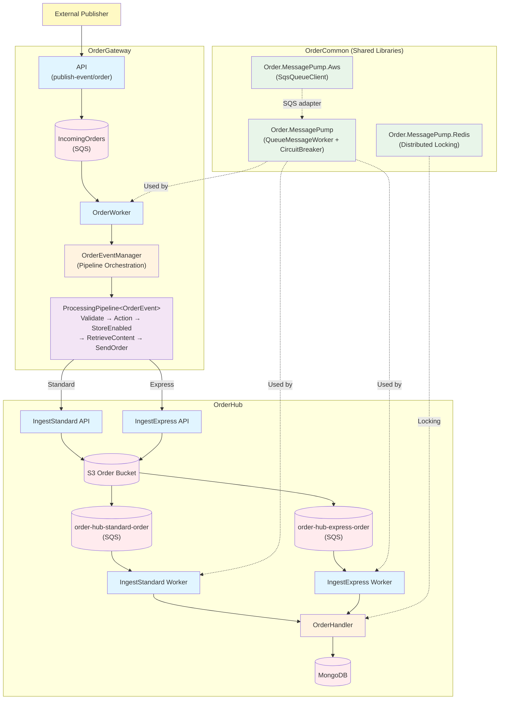

# Communication

`Communication` is a multi-solution `.NET 8` distributed order processing platform that ingests orders across two service boundaries through event-driven queues, step-based pipeline orchestration, and S3/MongoDB persistence.

It is designed as a production-grade layered architecture with OAuth-secured service-to-service communication, config-driven environment switching, Aspire orchestration, and resilient queue processing.

`Communication` demonstrates a specific approach:

- **Event-driven ingestion** through SQS queues with circuit-breaker resilience
- **Step-based pipeline orchestration** through `ProcessingPipeline<TEvent>` with pluggable stages
- **OAuth-secured cross-service routing** through client-credentials flow (Keycloak local / AWS production)
- **Dual-path persistence** through S3 storage + queue notification + MongoDB worker processing
- **Shared library primitives** through `Order.MessagePump` for queue pump, retry, and distributed locking

The result is a platform where OrderGateway validates, enriches, and routes events to OrderHub, which persists and processes them with duplicate protection and correlation tracking.

---

## Architecture Overview



### Layer Responsibilities

- `OrderGateway.Api/`: HTTP entry point for publishing order events
- `OrderGateway.OrderWorker/`: background worker that polls the IncomingOrders SQS queue
- `OrderGateway.Common/`: pipeline orchestration, event managers, NSwag-generated clients, mapping, feature flags
- `OrderHub.IngestStandard.Api/` + `IngestExpress.Api/`: ingest APIs that persist order payloads to S3
- `OrderHub.IngestStandard.Worker/` + `IngestExpress.Worker/`: workers that process S3 event notifications from queues
- `OrderHub.Common/`: handlers, managers, repository, S3 service, content processing, mappers
- `OrderHub.Contracts/`: shared request/response models and validation attributes
- `OrderHub.Api/`: read/query API for accessing persisted orders
- `OrderCommon/Order.MessagePump/`: generic queue worker abstraction with circuit breaker (Polly)
- `OrderCommon/Order.MessagePump.Aws/`: SQS adapter implementing queue client interface
- `OrderCommon/Order.MessagePump.Redis/`: Redis-based distributed locking

### Solution Layout

- `OrderGateway/src/OrderGateway.Api/`: API host for publishing order events
- `OrderGateway/src/OrderGateway.OrderWorker/`: background worker polling SQS
- `OrderGateway/src/OrderGateway.Common/`: shared business logic, pipeline, clients, mapping
- `OrderGateway/src/OrderGateway.AppHost/`: Aspire AppHost orchestrating API + Worker
- `OrderGateway/src/Order.ReplayConsole/`: diagnostic tool for replaying DLQ messages locally
- `OrderGateway/src/OrderGateway.UnitTests/`: unit tests (112 cases)
- `OrderGateway/src/OrderGateway.IntegrationTests/`: integration tests (LocalStack + resiliency)
- `OrderHub/src/OrderHub.Api/`: read/query API for persisted orders
- `OrderHub/src/OrderHub.IngestStandard.Api/`: standard-priority ingest API
- `OrderHub/src/OrderHub.IngestExpress.Api/`: express-priority ingest API
- `OrderHub/src/OrderHub.IngestStandard.Worker/`: standard-priority queue worker
- `OrderHub/src/OrderHub.IngestExpress.Worker/`: express-priority queue worker
- `OrderHub/src/OrderHub.Common/`: shared handlers, managers, repository, services, mappers
- `OrderHub/src/OrderHub.Contracts/`: contract models and validation attributes
- `OrderHub/src/OrderHub.AppHost/`: Aspire AppHost orchestrating 5 services
- `OrderHub/src/OrderHub.UnitTests/`: unit tests (94 cases)
- `OrderHub/src/OrderHub.IntegrationTests/`: integration tests (IngestExpress + resiliency)
- `OrderCommon/src/Order.MessagePump/`: generic queue worker pipeline with circuit breaker
- `OrderCommon/src/Order.MessagePump.Aws/`: AWS SQS adapter
- `OrderCommon/src/Order.MessagePump.Redis/`: Redis distributed locking
- `Order.MessageOperations/Order.MessageOperations.Api/`: diagnostic REST API for queue/S3 operations
- `Order.MessageOperations/Order.MessageOperations.Mcp/`: MCP server for AI-assisted tooling

---

## Project Scope

Current solution coverage includes:

- OrderGateway: API + worker with step-based processing pipeline
- OrderHub: two ingest API/worker pairs (Standard + Express) + read/query API
- OAuth client-credentials flow for cross-service auth (Keycloak local, AWS production)
- NSwag-generated API clients with correlation ID propagation
- Feature flag gating (LaunchDarkly) for per-store rollouts
- Shared queue pump library with circuit breaker, retry routing, and visibility timeout management
- Distributed locking via Redis for duplicate protection during ingestion
- Aspire AppHost orchestration for local multi-service development
- LocalStack infrastructure scripts (SQS, S3, MongoDB, Redis, Keycloak)
- Order.MessageOperations: diagnostic API + MCP server for queue inspection, DLQ replay, and S3 operations
- Unit and integration tests via xUnit + NSubstitute

---

## Evaluator Quick Path

If you are reviewing this project fresh, use this path:

1. Restore and build the solutions:
    ```bash
    dotnet restore OrderGateway/OrderGateway.sln
    dotnet build OrderGateway/OrderGateway.sln --no-logo
    dotnet restore OrderHub/OrderHub.slnx
    dotnet build OrderHub/OrderHub.slnx --no-logo
    ```
2. Run the test suite:
    ```bash
    dotnet test OrderGateway/OrderGateway.sln --no-logo --verbosity minimal
    dotnet test OrderHub/OrderHub.slnx --no-logo --verbosity minimal
    ```
3. Start local infrastructure (Docker required):
    ```powershell
    cd OrderHub/ifx-aws-cli/local
    ./start.ps1
    ```
4. Run Aspire AppHosts:
    ```powershell
    $env:DOTNET_ENVIRONMENT='localstack'; $env:ASPNETCORE_ENVIRONMENT='localstack'
    dotnet run --project OrderHub/src/OrderHub.AppHost/OrderHub.AppHost.csproj
    # In a second terminal:
    dotnet run --project OrderGateway/src/OrderGateway.AppHost/OrderGateway.AppHost.csproj
    ```

Expected result: all tests pass (`206+` cases), both Aspire dashboards show all services green, and the full pipeline executes through queue → pipeline → API → S3 → worker → MongoDB.

---

## Quick Start

### 1) Prerequisites

- .NET SDK 8+
- Docker Desktop (for LocalStack, MongoDB, Redis, Keycloak)
- PowerShell 7+
- Optional: Visual Studio 2022 or VS Code

After install, verify tools:

```powershell
dotnet --version
docker --version
pwsh --version
```

### 2) Start Local Infrastructure

```powershell
cd OrderHub/ifx-aws-cli/local
./stop.ps1
./clean.ps1 -Force
./start.ps1
```

Wait for **"All services are running!"** then verify:

```powershell
./status.ps1
```

Expected services:
- LocalStack: `http://localhost:4566`
- MongoDB: `mongodb://localhost:27018`
- Redis: `localhost:6379`
- Keycloak: `http://localhost:8081`

Then start OrderGateway infrastructure:

```powershell
cd ../../OrderGateway/ifx-aws-cli/local
./stop.ps1
./clean.ps1 -Force
./start.ps1
```

### 3) Build and Run

```powershell
dotnet restore OrderGateway/OrderGateway.sln
dotnet build OrderGateway/OrderGateway.sln
dotnet restore OrderHub/OrderHub.slnx
dotnet build OrderHub/OrderHub.slnx
```

Run OrderHub AppHost (orchestrates 5 services):

```powershell
$env:DOTNET_ENVIRONMENT='localstack'; $env:ASPNETCORE_ENVIRONMENT='localstack'
dotnet run --project OrderHub/src/OrderHub.AppHost/OrderHub.AppHost.csproj
```

Run OrderGateway AppHost (orchestrates API + Worker):

```powershell
$env:DOTNET_ENVIRONMENT='localstack'; $env:ASPNETCORE_ENVIRONMENT='localstack'
dotnet run --project OrderGateway/src/OrderGateway.AppHost/OrderGateway.AppHost.csproj
```

### 4) Confirm End-to-End

1. Both Aspire dashboards show all services running.
2. Keycloak OIDC discovery resolves: `http://localhost:8081/realms/ordergateway-local/.well-known/openid-configuration`
3. Run replay/publish to place a test event on the OrderGateway queue.
4. OrderWorker logs show processing and successful calls to OrderHub APIs.
5. OrderHub API logs show authorized requests (no 401).
6. MongoDB contains the persisted order data.

### 5) Tear Down

```powershell
# Stop AppHosts: Ctrl+C in each terminal, then:
cd OrderGateway/ifx-aws-cli/local
./stop.ps1
cd ../../OrderHub/ifx-aws-cli/local
./stop.ps1
```

---

## Testing

Run OrderGateway unit tests:

```bash
dotnet test OrderGateway/OrderGateway.sln --filter "FullyQualifiedName~UnitTests" --no-logo --verbosity minimal
```

Run OrderHub unit tests:

```bash
dotnet test OrderHub/OrderHub.slnx --filter "FullyQualifiedName~UnitTests" --no-logo --verbosity minimal
```

Run all tests (both solutions):

```bash
dotnet test OrderGateway/OrderGateway.sln --no-logo --verbosity minimal
dotnet test OrderHub/OrderHub.slnx --no-logo --verbosity minimal
```

### Integration Testing Strategy

```mermaid
graph TD
    UNIT_GW["OrderGateway<br/>Unit Tests<br/>(112 Cases)"]
    UNIT_GW -->|"Validates"| GW_DOMAIN["Managers / Handlers<br/>Mappers / Pipeline Steps<br/>Services / Validators"]

    UNIT_HUB["OrderHub<br/>Unit Tests<br/>(94 Cases)"]
    UNIT_HUB -->|"Validates"| HUB_DOMAIN["Ingestion Mappers<br/>Validation Attributes<br/>Helpers / Encoders"]

    INT_GW["OrderGateway<br/>Integration Tests"]
    INT_GW_E2E["End-to-End Event Tests"]
    INT_GW_E2E -->|"Uses"| LS_GW["LocalStack<br/>(SQS + S3)"]
    INT_GW_E2E -->|"Validates"| GW_FLOW["Full Pipeline:<br/>Queue → Validate → Enrich<br/>→ Map → Send"]

    INT_GW_REDIS["Redis CRUD Tests"]
    INT_GW_REDIS -->|"Validates"| REDIS["Redis Cache<br/>Operations"]

    INT_GW_PUMP["MessagePump<br/>Resiliency Tests"]
    INT_GW_PUMP -->|"Validates"| CB["Circuit Breaker<br/>Visibility Timeout<br/>Retry Routing"]

    INT_GW --> INT_GW_E2E
    INT_GW --> INT_GW_REDIS
    INT_GW --> INT_GW_PUMP

    INT_HUB["OrderHub<br/>Integration Tests"]
    INT_HUB_INGEST["IngestExpress<br/>Shipment Order Tests"]
    INT_HUB_INGEST -->|"Validates"| HUB_FLOW["API → S3 Persist<br/>Validation / Dedup<br/>Content Truncation"]

    INT_HUB_PUMP["MessagePump<br/>Resiliency Tests"]
    INT_HUB_PUMP -->|"Validates"| CB2["Circuit Breaker<br/>Visibility Timeout<br/>Retry Routing"]

    INT_HUB --> INT_HUB_INGEST
    INT_HUB --> INT_HUB_PUMP

    UNIT_GW -->|"Pass"| R1["✓ 112 Unit Green"]
    UNIT_HUB -->|"Pass"| R2["✓ 94 Unit Green"]
    INT_GW -->|"Pass"| R3["✓ Integration Green"]
    INT_HUB -->|"Pass"| R4["✓ Integration Green"]

    R1 --> FINAL["All Tests Green<br/>Solutions Valid"]
    R2 --> FINAL
    R3 --> FINAL
    R4 --> FINAL

    FINAL -->|"Confirms"| CHECKS["✓ Pipeline Orchestration<br/>✓ Queue Resiliency<br/>✓ S3 Persistence<br/>✓ OAuth Contract<br/>✓ Duplicate Detection"]

    style UNIT_GW fill:#f3e5f5
    style UNIT_HUB fill:#f3e5f5
    style INT_GW fill:#fff3e0
    style INT_HUB fill:#fff3e0
    style INT_GW_E2E fill:#e1f5ff
    style INT_GW_REDIS fill:#e1f5ff
    style INT_GW_PUMP fill:#e1f5ff
    style INT_HUB_INGEST fill:#e1f5ff
    style INT_HUB_PUMP fill:#e1f5ff
    style GW_DOMAIN fill:#e8f5e9
    style HUB_DOMAIN fill:#e8f5e9
    style GW_FLOW fill:#e8f5e9
    style HUB_FLOW fill:#e8f5e9
    style LS_GW fill:#fff9c4
    style REDIS fill:#fff9c4
    style CB fill:#fce4ec
    style CB2 fill:#fce4ec
    style R1 fill:#c8e6c9
    style R2 fill:#c8e6c9
    style R3 fill:#c8e6c9
    style R4 fill:#c8e6c9
    style FINAL fill:#81c784
    style CHECKS fill:#c8e6c9
```



Current status:
- OrderGateway unit tests: `112` passing
- OrderHub unit tests: `94` passing
- Integration tests: all passing
- Total: `206+` passing

---

## Key Abstractions

### Processing Pipeline (OrderGateway)

The pipeline is composed of pluggable `IProcessingStep<TEvent>` implementations:

| Step | Purpose |
|------|---------|
| `ValidateStep<T>` | Validates event via `IsValid()`, rejects invalid events |
| `ActionStep<T>` | Executes inline telemetry/metric actions |
| `StoreEnabledStep<T>` | Feature-flag gate — checks LaunchDarkly for store enablement |
| `RetrieveOrderContentStep` | Retrieves cloud content by key, attaches to context |
| `SendOrderStep<T>` | Routes to Standard or Express ingest API via NSwag clients |

### OrderHub Handler Flow

The `BaseMessageHandler<T>` template method provides:

| Phase | Behavior |
|-------|----------|
| Parse | Deserialize SQS message body into typed payload |
| Process | S3 retrieval → content processing → mapping → lock acquisition → MongoDB insert |
| Retry | Exponential backoff with SQS visibility timeout extension |
| Poison | Route to dead-letter queue after max retries |

### Shared Queue Worker (OrderCommon)

| Component | Purpose |
|-----------|---------|
| `QueueMessageWorker<T>` | Generic worker loop with Polly circuit breaker |
| `SqsQueueClient` | SQS adapter: get/complete/poison/publish messages |
| `SimpleRedisLockManager` | Distributed locking for duplicate protection |

---

## Configuration and Security

### Environment Variables

The same code path is used for LocalStack and AWS. Configuration controls the behavior:

| Variable | Purpose |
|----------|---------|
| `DOTNET_ENVIRONMENT` / `ASPNETCORE_ENVIRONMENT` | Selects appsettings overlay (`localstack`, `aws`) |
| `OAuth:*:AuthorityUrl` | Token endpoint for client-credentials flow |
| `OAuth:*:ClientId` / `ClientSecret` / `Scope` | OAuth client registration |
| `*:BridgeOAuthSettings:Authority` / `Audience` | JWT bearer validation on OrderHub APIs |
| `Clients:IngestStandardClient:BaseAddress` | Standard ingest API destination |
| `Clients:IngestExpressClient:BaseAddress` | Express ingest API destination |
| `Aws:Connection:ServiceUrl` / `Region` | AWS/LocalStack endpoint |
| `QueueClientOptions:*:QueueName` | SQS queue names |

### AWS Production

- Store `ClientSecret` and API keys in Secrets Manager/SSM and inject at runtime.
- Use IAM roles for runtime credentials where possible.
- Do not keep production secrets in source-controlled appsettings.

### Local Auth Contract

For local development, the token issuer is Keycloak realm `ordergateway-local`:

- Authority: `http://localhost:8081/realms/ordergateway-local`
- Token endpoint: `http://localhost:8081/realms/ordergateway-local/protocol/openid-connect/token`
- Audience: `non-production-resources`
- Required scopes: `commonorders.ingeststandard-api.communication.write`, `commonorders.ingestexpress-api.communication.write`

---

## Engineering Practices Demonstrated

- SOLID-oriented layered architecture across multiple solutions
- Step-based pipeline with pluggable processing stages
- OAuth client-credentials and JWT bearer validation for service-to-service auth
- Dependency injection with primary constructors across services, handlers, and managers
- NSwag code generation for type-safe API clients from swagger.json
- Circuit breaker and retry policies (Polly) for resilient queue processing
- Distributed locking via Redis for concurrent duplicate protection
- Feature flag integration (LaunchDarkly) for controlled per-store rollouts
- Aspire AppHost orchestration for multi-service local development
- Structured logging with Serilog + correlation IDs + NewRelic/Splunk/OpenTelemetry
- Config-driven environment switching (appsettings.localstack.json / appsettings.aws.json)
- Test layering (unit + integration) with LocalStack, NSubstitute mocks, and explicit behavior verification

---

## Reference Implementation Snippets

### Processing Pipeline — Step-Based Orchestration

```csharp
internal sealed class ProcessingPipeline<TEvent>(IReadOnlyList<IProcessingStep<TEvent>> steps)
    : IProcessingPipeline<TEvent> where TEvent : IEvent
{
    public async Task<(StepResult Result, StepContext Context)> RunAsync(TEvent evt, CancellationToken ct = default)
    {
        var context = new StepContext();
        foreach (var step in steps)
        {
            var result = await step.ExecuteAsync(evt, context, ct);
            if (!result.ShouldContinue)
                return (result, context);
        }
        return (StepResult.Complete(), context);
    }
}
```

### Pipeline Assembly — Manager Builds Steps and Runs Pipeline

```csharp
public async Task<ProcessingResult> ProcessEvent(OrderEvent orderEvent)
{
    var steps = new List<IProcessingStep<OrderEvent>>
    {
        new ValidateStep<OrderEvent>(),
        new ActionStep<OrderEvent>(async (evt, _, _) =>
        {
            NewRelic.Api.Agent.NewRelic.IncrementCounter(
                evt.IsStandardPriority
                    ? "Custom/Order/Priority/Standard"
                    : "Custom/Order/Priority/Express");
            await Task.CompletedTask;
        }),
        new StoreEnabledStep<OrderEvent>(featureToggle),
        new RetrieveOrderContentStep(cloudContentService, contentSizeMetricEmitter),
        new SendOrderStep<OrderEvent>(orderService)
    };

    var pipeline = new ProcessingPipeline<OrderEvent>(steps);
    (StepResult stepResult, StepContext context) = await pipeline.RunAsync(orderEvent);

    return ProcessingResult.From(stepResult, context);
}
```

### Cross-Service Routing — Standard vs Express

```csharp
public class OrderService(
    IIngestStandardClient standardClient,
    IIngestExpressClient expressClient,
    IOrderRequestMapper orderMapper,
    ILogger logger
) : IOrderService
{
    public async Task<OrderIngestResult> SendAsync(IOrderEvent evt, StepContext context, CancellationToken ct = default)
    {
        return evt switch
        {
            OrderEvent order => await SendOrderAsync(order, context, evt.IsStandardPriority, ct),
            _ => OrderIngestResult.Invalid("Unsupported event type")
        };
    }

    private async Task<OrderIngestResult> SendOrderAsync(
        OrderEvent order, StepContext context, bool isStandard, CancellationToken ct)
    {
        if (isStandard)
        {
            var response = await standardClient
                .WithCorrelationId(order.CorrelationId)
                .AddShipmentOrderAsync(orderMapper.MapStandard(order, context), ct);
            return OrderIngestResult.Ingested(response.Id);
        }

        var expressResponse = await expressClient
            .WithCorrelationId(order.CorrelationId)
            .AddShipmentOrderAsync(orderMapper.MapExpress(order, context), ct);
        return OrderIngestResult.Ingested(expressResponse.Id);
    }
}
```

### Worker Processing — S3 Retrieval + Lock + MongoDB Persist

```csharp
protected override async Task<ProcessingResult> ProcessPayload(OrderPayload payload)
{
    var getObjectResponse = await s3Service.GetObjectAsync<OrderRequest>(payload.BucketName, payload.Key);
    if (getObjectResponse.ErrorType != S3ErrorType.NONE)
        return ProcessingResult.Poison($"S3 retrieval failed: {getObjectResponse.ErrorMessage}");

    var contentProcessingResult = contentProcessingService.ProcessContent(
        payload.ParsedKey.ChannelType,
        getObjectResponse.Content.Content ?? string.Empty);

    var channelOrder = orderMapper.ToInternalModel(
        getObjectResponse.Content, payload.ParsedKey.OrderId,
        contentProcessingResult, payload.ParsedKey.Priority);

    var lease = await TryAcquireCustomerLockAsync(log, customerId);
    if (!lease.IsAcquired)
        return ProcessingResult.Retry("Lock acquisition failed");

    try
    {
        await repository.InsertAsync(channelOrder);
    }
    finally
    {
        await customerLockService.ReleaseLocksAsync(lease);
    }

    return ProcessingResult.Complete();
}
```

### Ingestion with Duplicate Detection

```csharp
public async Task<AddOrderResult> AddOrderAsync(OrderRequest request, Priority priority)
{
    var existingOrder = await GetExistingOrder(request, priority);
    if (existingOrder != null)
        return AddOrderResult.DuplicateRequest(existingOrder.OrderId);

    var orderId = ObjectId.GenerateNewId().ToString();
    var s3OrderKey = new S3OrderKey
    {
        Priority = priority,
        MerchantName = (MerchantName)request.Merchant.Name,
        ChannelType = request.ChannelType,
        SourceOrderId = request.Merchant.OrderId,
        OrderId = orderId
    };

    await PersistOrderRequest(request, s3OrderKey);
    return AddOrderResult.NewOrder(orderId);
}
```

### Queue Worker — Circuit Breaker Pattern

```csharp
public class QueueMessageWorker<TMessage> : MessagePipelineWorkerBase<TMessage> where TMessage : class
{
    private readonly AsyncCircuitBreakerPolicy policy;

    public QueueMessageWorker(
        QueueMessageWorkerOptions options,
        IQueueClient<TMessage> queue,
        IMessageHandler<TMessage> handler) : base(options)
    {
        policy = Policy
            .Handle<Exception>()
            .CircuitBreakerAsync(
                exceptionsAllowedBeforeBreaking: options.ExceptionsAllowedBeforeBreaking,
                durationOfBreak: TimeSpan.FromSeconds(options.DurationOfBreakSeconds),
                onBreak: (ex, ts) => Log.Error(ex, "Circuit broken"),
                onReset: () => Log.Information("Circuit reset"));
    }
}
```

### Aspire AppHost — OrderHub Orchestration

```csharp
var builder = DistributedApplication.CreateBuilder(args);

var orderApi = builder.AddProject<Projects.OrderHub_Api>("order-api")
    .WithEnvironment("DOTNET_ENVIRONMENT", "localstack")
    .WithEnvironment("Aws__Connection__ServiceUrl", "http://localhost:4566")
    .WithEnvironment("ENABLE_OTEL", "true")
    .WithExternalHttpEndpoints();

var ingestExpressApi = builder.AddProject<Projects.OrderHub_IngestExpress_Api>("ingest-express-api")
    .WithEnvironment("QueueClientOptions__EXPRESS__QueueName", "order-hub-express-order")
    .WithExternalHttpEndpoints();

var ingestExpressWorker = builder.AddProject<Projects.OrderHub_IngestExpress_Worker>("ingest-express-worker")
    .WithReference(ingestExpressApi);

builder.Build().Run();
```
